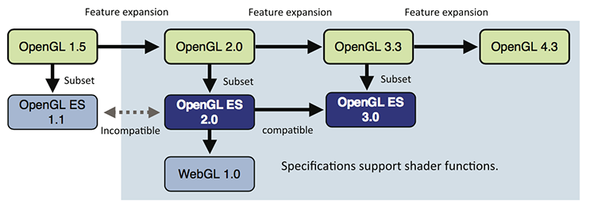

# wegl
WebGL 学习，偏向0基础，本书大部分知识来源于 《WebGL 编程指南》，有兴趣的同学建议购买学习。

## WebGL 起源
在计算机上使用最广泛的两种三维图形的渲染技术是 `Direct3D` 和 `OpenGL`。

`OpenGL` 最初是由 SGI(`Silicon Graphics Inc`)开发，并在 1992 年发布为开源标准。

`WebGL` 实际上是 OpenGL 的一个特殊的版本 `OpenGL ES` 中派生出来的，OpenGL ES 于 2003 - 2004 年被首次提出，并在 2007 年 (ES 2.0) 和 2012 年 (ES 3.0) 进行了两次升级。WebGL 是基于 ES 2.0 的。 

