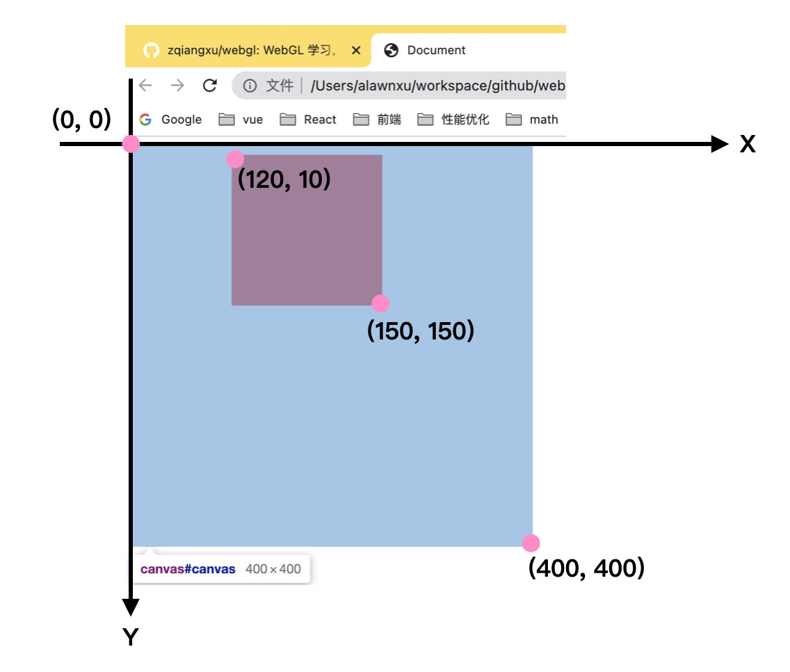

# 绘制矩形

使用 Canvas 绘制一个简单的红色矩形。

```html
<canvas id="canvas" width="400" height="400" />
<script type="text/javascript">
const canvas = document.getElementById('canvas');

// 获取绘制二维图形的绘制上下文
const context = canvas.getContext('2d');

// 设置填充色为红色
context.fillStyle = 'rgba(255, 0, 0, 1)';

// 填充矩形
context.fillRect(100, 10, 150, 150);
</script> 
```

## canvas 的坐标系

;